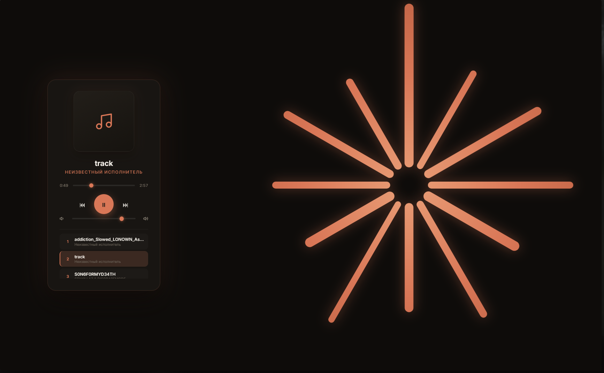

# 🎵 Claude Player (music_service)

Небольшой веб-музыкальный плеер на **FastAPI**. Сервис сканирует папку с MP3-файлами, сохраняет треки в SQLite и воспроизводит их в тёмном интерфейсе в стиле Claude. Фон — анимированный логотип, лучи которого реагируют на музыку в реальном времени.

<!-- Вставьте сюда скриншот:  -->

## Возможности

- Автоматическое сканирование `static/audio/*.mp3` и добавление новых треков в базу
- Чтение названия и исполнителя из ID3-тегов (`tinytag`); если тегов нет, данные берутся из имени файла в формате `Исполнитель - Название.mp3`
- Плеер: play/pause, предыдущий/следующий трек (по кругу), перемотка, регулятор громкости
- Плейлист с подсветкой текущего трека и переключением по клику
- Визуализация на `<canvas>`: лучи логотипа реагируют на частоты звука через Web Audio API, в паузе «дышат»; поддерживается `prefers-reduced-motion`
- REST API для получения списка треков

## Стек

| Слой | Технологии |
|---|---|
| Backend | Python, FastAPI, Jinja2 |
| База данных | SQLite, SQLAlchemy |
| Метаданные аудио | TinyTag |
| Frontend | HTML, CSS, JavaScript (без фреймворков), Web Audio API |

## Структура проекта

```
music_service/
├── main.py            # FastAPI-приложение и API-маршруты
├── database.py        # Подключение к SQLite и модель TrackModel
├── music.db           # База данных (создаётся автоматически)
├── requirements.txt   # Зависимости
├── PLAN.md            # План разработки
├── templates/
│   └── index.html     # Страница плеера
└── static/
    ├── css/style.css  # Стили
    └── audio/         # Сюда кладутся .mp3 файлы
```

## Установка и запуск

1. Клонируйте репозиторий и перейдите в папку проекта:

   ```bash
   git clone <ссылка-на-репозиторий>
   cd music_service
   ```

2. Создайте виртуальное окружение и установите зависимости:

   ```bash
   python -m venv venv
   # Windows
   venv\Scripts\activate
   # Linux / macOS
   source venv/bin/activate

   pip install -r requirements.txt
   ```

3. Создайте папку для музыки и положите в неё MP3-файлы:

   ```bash
   mkdir -p static/audio
   ```

   > Папка `static/audio` должна существовать до запуска: иначе сканирование завершится ошибкой.

4. Запустите сервер:

   ```bash
   uvicorn main:app --reload
   ```

5. Откройте в браузере <http://127.0.0.1:8000>.

При открытии страницы фронтенд сам вызывает сканирование папки и загружает плейлист. Таблица в `music.db` создаётся при первом запуске.

## API

| Метод | Путь | Описание |
|---|---|---|
| `GET` | `/` | Страница плеера |
| `GET` | `/api/tracks` | Список всех треков: `id`, `title`, `artist`, `src`, `cover` |
| `POST` | `/api/tracks/scan` | Сканирует `static/audio` и добавляет новые треки в базу |

Автодокументация Swagger доступна по адресу <http://127.0.0.1:8000/docs>.

Пример ответа `GET /api/tracks`:

```json
[
  {
    "id": 1,
    "title": "Летний Вайб",
    "artist": "Аквамариновый Закат",
    "src": "/static/audio/Аквамариновый Закат - Летний Вайб.mp3",
    "cover": null
  }
]
```

## Как называть файлы

Если в MP3 нет тегов, название и исполнитель берутся из имени файла:

| Имя файла | Исполнитель | Название |
|---|---|---|
| `Artist - Song.mp3` | Artist | Song |
| `Song.mp3` | Неизвестный исполнитель | Song |

## Планы

Подробный список задач — в [PLAN.md](PLAN.md).

## Лицензия

<!-- Укажите лицензию, например MIT -->
